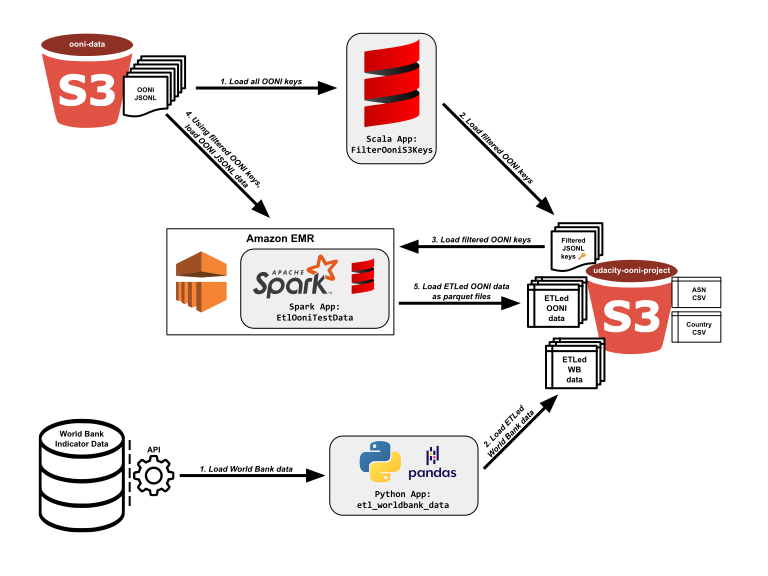

# World Bank Development Indicator Data ETL

## Overview

This ETL app is one of three that fits into a data pipeline for a larger project, an Open Observatory of Network Intereference (OONI) data ETL project. 

## Purpose

The purpose of this simple app is to extract data from the World Bank's [World Development Indicator](https://data.worldbank.org/indicator) data API, clean the data somewhat, then load data into the destination S3 bucket as parquet files.

This app takes care of the data in the lower third of the diagram that follows:

